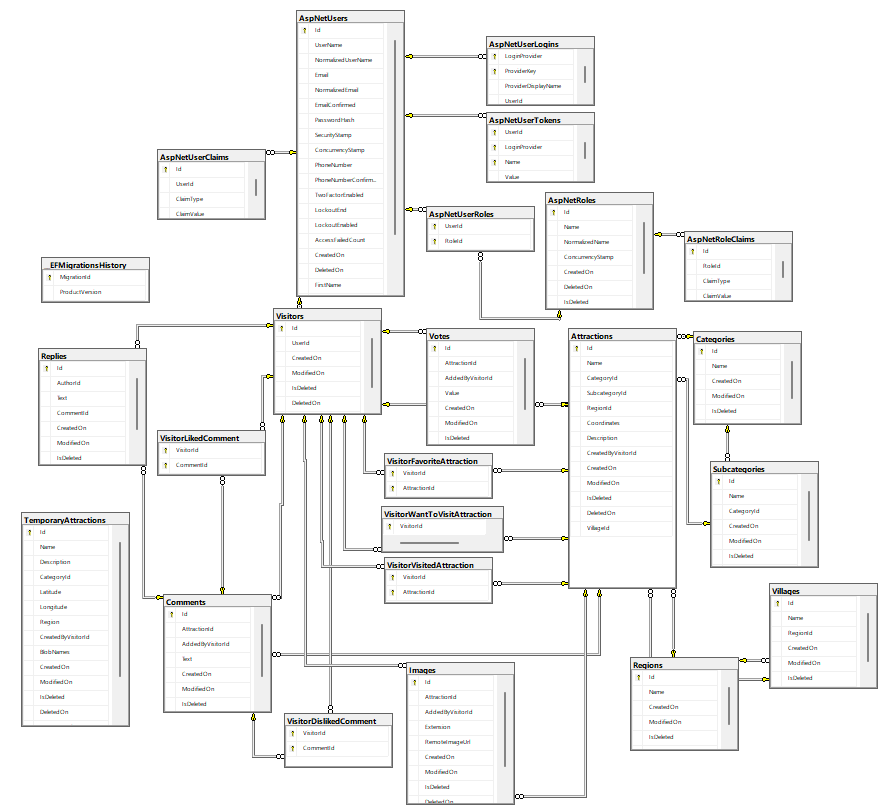

# Explore-Bulgaria-ASP.NET-Core
ASP.NET Core web application as my defense project @ SoftUni's ASP.NET Core course

## Application Overview
A web application for exploring attractions in Bulgaria.
9000+ attractions having:
+ one of the following categories:
	+ Buildings and Architecture
	+ Culture and Art
	+ Historic
	+ Nature
	+ Sports
	+ Eco-trails and routes
	+ Fun activities
	+ Attractions
	+ Rural and eco tourism
	+ Shelters
+ one of the 90 subcategories
+ one of the 245 regions / cities
+ one of the 1000+ villages

Extending all of the above listed possible :)

## Users
+ General users
	+ unauthorized users
		+ can browse through all attractions
		+ can filter attractions by
			+ category 
			+ subcategory 
			+ region/city 
			+ village 
			+ search term, found in the name/description
		+ can get recommendations about what attractions to visit across a particular route
			+ select a starting point (pin a marker on the map)
			+ select an end point (pin a marker on the map)
			+ select a category
			+ your route is drawn
			+ voila - recommended attractions with information about distance from the road and from the starting point
	+ authorized users
		+ can do all of the above
		+ can rate attractions from 1 to 5
		+ can mark attractions as their favorites, as candidates for visiting, and as visited
		+ can comment on attractions
		+ can like, dislike and reply to comments
		+ can recommend attraction to be reviewed by an admin and added
		+ can initiate a one-to-one chat with an admin
		+ can view and edit their profile page (uploading an avatar supported)
		+ can view their favorite attractions, the ones they want to visit, as well as the visited ones
+ Admin user
    + can do all of the above
	+ can approve/reject attracions, recommended for adding by users
		+ can edit the attraction information
	+ can delete attractions
	+ can add categories, subcategories, regions/cities, villages
	+ can enter a one-to-one chat room with users

## Technologies and Tools
+ ASP.NET Core 6.0
	+ MVC
	+ Web API
	+ SignalR
+ ASP.NET-Core-Template by [Nikolay Kostov](https://github.com/NikolayIT)
+ Entity Framework Core 6.0
+ Azure Blob Storage
+ SendGrid
+ NUnit
+ Moq
+ JavaScript
+ AJAX
+ HTML 5
+ CSS
+ Bootstrap
+ FontAwesome
+ Leaflet.js
+ SweetAlert2
+ AdminLTE.IO

## DB Scheme

